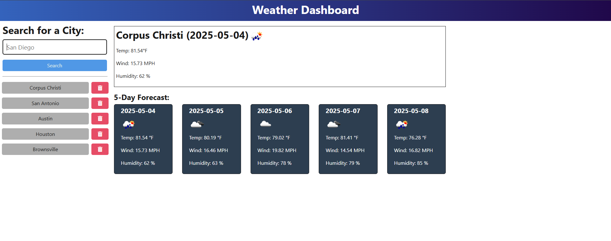

# API-Weather-Dashboard


## Description
This is a TypeScript OOP project that uses OpenWeatherAPI to serve live weather data to the user, based on their requested inputs, and populates a database. The database can be manipulated by means of adding & removing cities that populate it. The data provided is a 5 calendar day forecast that shows data for Temperature, Wind Speed, & Humidity (and an icon for the weather on that day).

## Table of Contents
- [Description](#description)
- [Installation](#installation)
- [Technologies](#technologies)
- [License](#license)
- [Links](#links)
- [Questions](#questions)

## Installation
If running this repo locally via git clone, use the following commands:

```bash
npm i 
```
```bash
npm run start:dev
```

Screenshot of functional application visual: <br>
 <br>

## Technologies
* JavaScript
* TypeScript
* Node.js
* Render
* OpenWeather API

## License
This project is licensed under the MIT license.

## Links
- [GitHub Repository](https://github.com/Bakenavva/API-Weather-Dashboard)
- [Deployed Weather Dashboard](https://api-weather-dashboard-6tbm.onrender.com)

## Questions
Further questions can reach me via:
- GitHub: [Bakenavva](https://github.com/Bakenavva)
- Email:  ernestoaleman00@gmail.com
